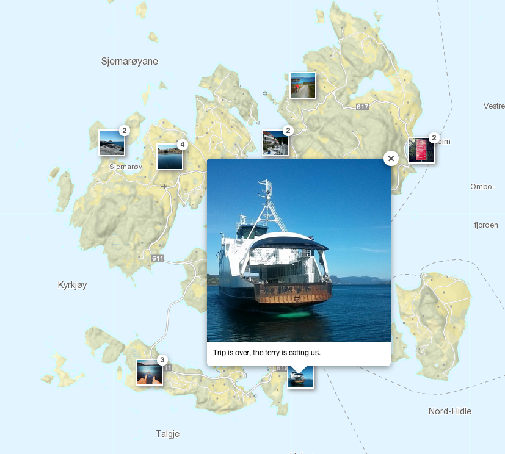

## Leaflet.Instagram

Plugin to show Instagram photos and videos on your Leaflet map. [Read more](http://blog.thematicmapping.org/2014/06/showing-instagram-photos-and-videos-on.html)

[](http://turban.github.io/Leaflet.Instagram/examples/popup-cluster.html)

### Requires
- [Leaflet](http://leafletjs.com/)
- [reqwest](https://github.com/ded/reqwest)

Image cluster also requires: 
- [Leaflet.markercluster](https://github.com/Leaflet/Leaflet.markercluster)

Fancybox also requires:
- [jQuery](http://jquery.com/)
- [fancyBox](http://fancyapps.com/fancybox/)

### Usage
Load data from [Instagram API](http://instagram.com/developer/):
```JavaScript
L.instagram('instagram_api_url_with_access_token').addTo(map);
```

Load data from [CartoDB](http://blog.thematicmapping.org/2014/06/syncing-your-instagram-photos-to-cartodb.html):
```JavaScript
L.instagram('cartodb_url_with_sql').addTo(map); 
```

[See example](http://turban.github.io/Leaflet.Instagram/examples/popup.html)

With image cluster:
```JavaScript
L.instagram.cluster('cartodb_url_with_sql').addTo(map); 
```

[See example](http://turban.github.io/Leaflet.Instagram/examples/popup-cluster.html)

Fancybox instead of popup:
```JavaScript
L.instagram.fancybox('cartodb_url_with_sql').addTo(map); 
```

[See example](http://turban.github.io/Leaflet.Instagram/examples/fancybox.html)

Fancybox with image cluster:
```JavaScript
L.instagram.cluster('cartodb_url_with_sql', {
	featureGroup: L.instagram.fancybox
}).addTo(map); 
```

[See example](http://turban.github.io/Leaflet.Instagram/examples/fancybox-cluster.html)

### Options

#### L.Instagram(url, options)

| Option             | Type           | Default                                                       | Description                         |
| -------------------| -------------- | ------------------------------------------------------------- | ----------------------------------- |
| icon               | Object         | { iconSize: [40, 40], className: 'leaflet-marker-instagram' } | [Icon options](http://leafletjs.com/reference.html#icon-options)                        |
| popup              | Object         | { className: 'leaflet-popup-instagram' }                      | [Popup options](http://leafletjs.com/reference.html#popup-options)                       |
| imageTemplate      | String         | [See source code](https://github.com/turban/Leaflet.Instagram/blob/gh-pages/Leaflet.Instagram.js)                                               | [Template string for image and video](http://leafletjs.com/reference.html#util-template) |
| videoTemplate      | String         | [See source code](https://github.com/turban/Leaflet.Instagram/blob/gh-pages/Leaflet.Instagram.js)                                               | [Template string for image and video](http://leafletjs.com/reference.html#util-template) |
| onClick            | Function       | Open popoup with image/video.                                 | Image click handler                 |

#### L.Instagram.Cluster(url, options)

| Option             | Type           | Default                                                       | Description                         |
| -------------------| -------------- | ------------------------------------------------------------- | ----------------------------------- |
| featureGroup       | Object         | L.instagram                                                   | Alternative: L.instagram.fancybox   |
| iconCreateFunction | Function       | Icon showing number of images in cluster                      | Function to create cluster icon     |

You can also use all [Leaflet.markercluster options](https://github.com/Leaflet/Leaflet.markercluster#all-options).

#### L.Instagram.Fancybox(url, options)

| Option             | Type           | Default                                                       | Description                         |
| -------------------| -------------- | ------------------------------------------------------------- | ----------------------------------- |
| fancybox           | Object         | [See source code](https://github.com/turban/Leaflet.Instagram/blob/gh-pages/Leaflet.Instagram.Fancybox.js)                                               | [Fancybox options](http://fancyapps.com/fancybox/#docs)                    |
| onClick            | Function       | Open lightbox with image/video                                | Image click handler                 |

### License

The MIT License (MIT)

Important! The license does not cover external code in the lib folder. [Fancybox is licensed under a CC BY-NC 3.0 license](http://www.fancyapps.com/fancybox/#license). 
